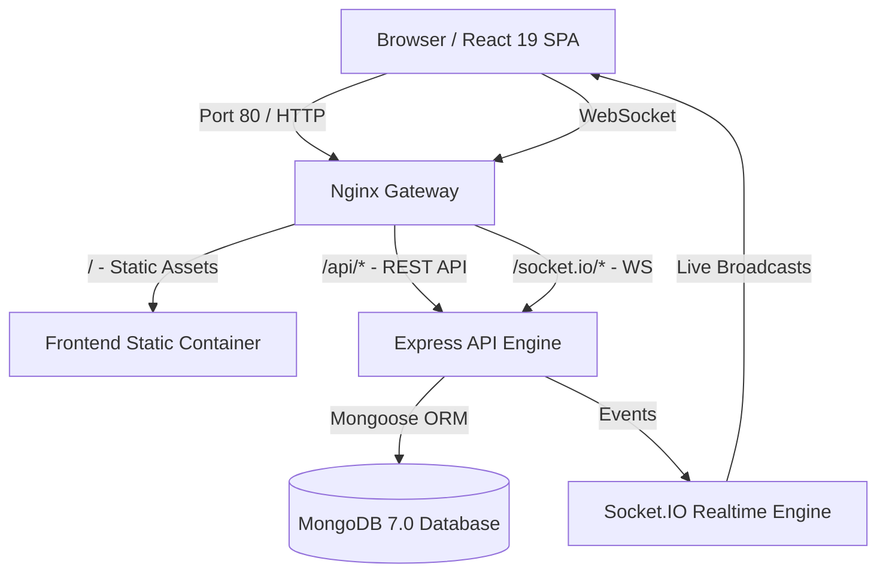
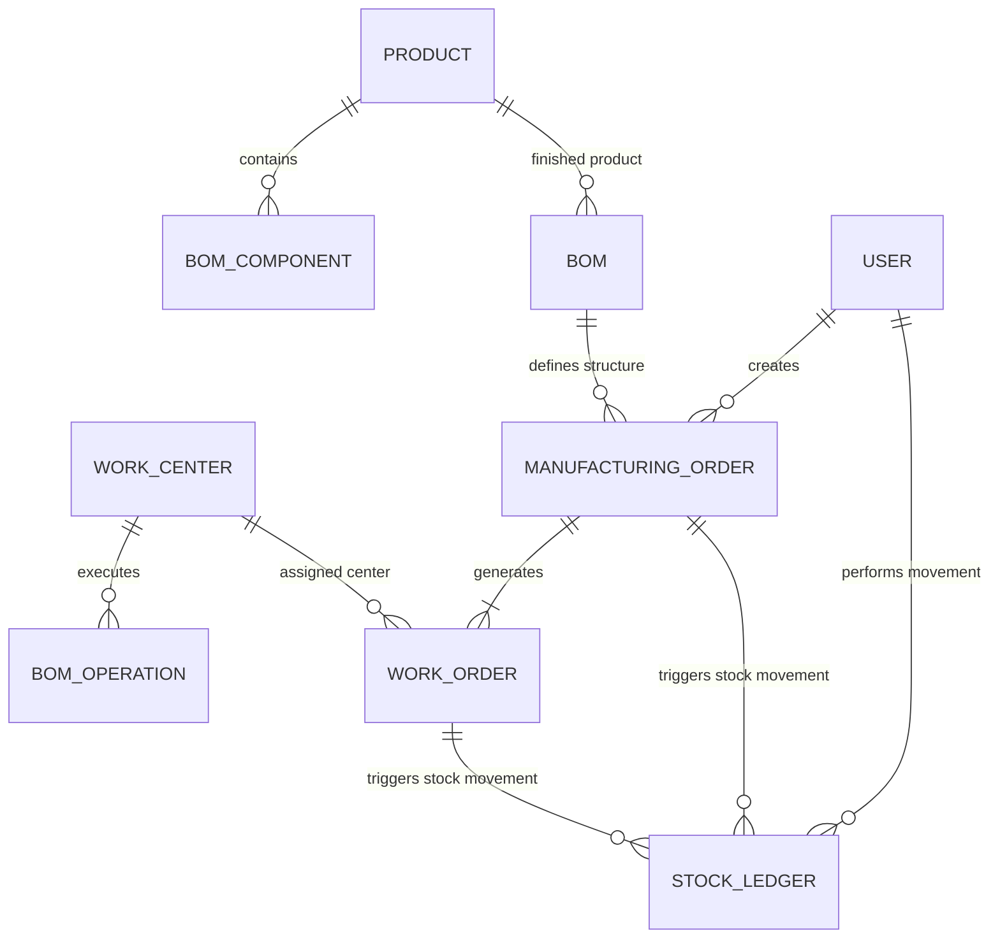

# Matrick Manufacturing System - Architectural Blueprint

This document details the system design, frontend and backend patterns, data schemas, real-time event pipeline, and container deployment topology for the **Matrick Manufacturing System (MMS)**.

---

## 1. High-Level System Architecture

The Matrick Manufacturing System uses a microservices-ready full-stack architecture. An **Nginx** reverse proxy acts as the unified entry point routing client HTTP requests, REST API endpoints, and WebSocket connections.



---

## 2. Component Architecture Breakdown

### 2.1 Frontend Architecture (React 19 + Vite)
- **State Management**: React Context (`AuthContext`) manages authenticated user state, JWT tokens, and user preferences.
- **Routing**: `react-router-dom` handles client-side routing with protected route wrappers (`ProtectedRoute`, `PublicRoute`).
- **UI Components**: Built with Tailwind CSS, Lucide icons, and Recharts. Designed as modular, reusable components inside `client/src/components/`.
- **Real-Time Subscription**: Custom Socket.IO client hook (`useSocket`) subscribes to production events (`mo:created`, `wo:status_changed`, `stock:updated`) and triggers optimistic UI re-renders.

### 2.2 Backend Architecture (Express + Node.js v20)
- **Controller-Service-Repository Pattern**:
  - `controllers/`: Handles HTTP request validation and API responses.
  - `services/`: Encapsulates core manufacturing business logic (e.g., BOM stock deduction, WO sequence verification).
  - `models/`: Mongoose schemas defining MongoDB document constraints.
- **Error Handling & Middleware**:
  - `asyncHandler`: Wraps async controller methods to forward errors to central error middleware.
  - `protect` / `requireRole`: Validates JWT tokens and enforces role permissions (`admin`, `manager`, `operator`, `quality_inspector`).
- **Structured Logging**: `winston` logs requests and errors in development and production formats.

### 2.3 Database Architecture (MongoDB 7.0 + Mongoose)
Collections & Entity Relationships:



Primary Collections:
1. `users`: Stores encrypted credentials, roles, and password reset OTP hashes.
2. `products`: Inventory catalog items (raw materials, components, finished goods) with stock levels.
3. `workcenters`: Machine and labor station capacity, hourly costs, and statuses.
4. `boms`: Bill of Materials containing component items and sequence operations.
5. `manufacturingorders`: Master production run records with required components and status.
6. `workorders`: Individual shop floor operation steps with timers and status.
7. `stockledgers`: Immutable ledger tracking every stock addition or deduction.

### 2.4 Real-Time Architecture (Socket.IO)
Whenever a state mutation occurs in the backend (e.g., operator completes a Work Order), Express services emit Socket.IO events:

- `mo:created`: Broadcasts new MO creation to manager dashboards.
- `mo:updated`: Updates MO progress bars across all clients.
- `wo:status_changed`: Notifies operators when sequential operations become `ready`.
- `stock:updated`: Refreshes inventory counts dynamically without requiring manual page reloads.

---

## 3. Module Communication & Execution Flow

```
Manufacturing Order (MO)
        ↓  (Reads BOM & verifies component stock)
Work Orders (WOs)
        ↓  (Operator launches sequential operations: Start ➔ Pause ➔ Complete)
Inventory (Stock Ledger)
        ↓  (Raw materials deducted upon consumption; Finished goods added upon MO completion)
Analytics & Reports
        ↓  (KPIs, work center utilization, stock valuation auto-update)
```

1. **MO Creation**: Manager creates an MO for 10 units of `FP-TAB-001`.
2. **Component Reservation**: Backend checks `RM-LEG-101` and `RM-TOP-102` stock levels.
3. **WO Generation**: Backend auto-generates Work Orders for each operation defined in the BOM (`WO-01 Frame Assembly`, `WO-02 Sanding`, `WO-03 Packaging`).
4. **WO Execution**: Operator opens `WO-01` on the shop floor portal and clicks **Start**. Timer starts tracking `actualDurationMinutes`.
5. **Stock Movement**: Completing `WO-01` consumes allocated raw materials and records entries in `stockledgers` (`RAW_MATERIAL_CONSUMPTION`).
6. **Finished Goods Output**: Completing the final WO updates MO status to `completed` and credits 10 units of `FP-TAB-001` to inventory (`FINISHED_GOODS_PRODUCTION`).
7. **Analytics**: Dashboard graphs re-calculate material consumption velocity and work center efficiency.

---

## 4. Container & Deployment Topology

The application is fully containerized with **Docker Compose**:

- **Nginx Gateway (`mms_proxy`)**: Fronts external traffic on Port 80/443.
- **Frontend SPA (`mms_frontend`)**: Serves compiled Vite/React static bundle.
- **Backend Service (`mms_backend`)**: Runs Express REST API and Socket.IO on Port 5000.
- **MongoDB Database (`mms_mongodb`)**: Persistent Mongo 7.0 database volume.

For details on building and deploying the container stack, refer to [`docs/deployment.md`](deployment.md).
